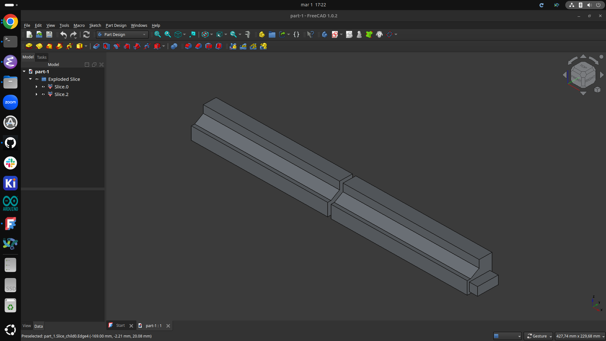
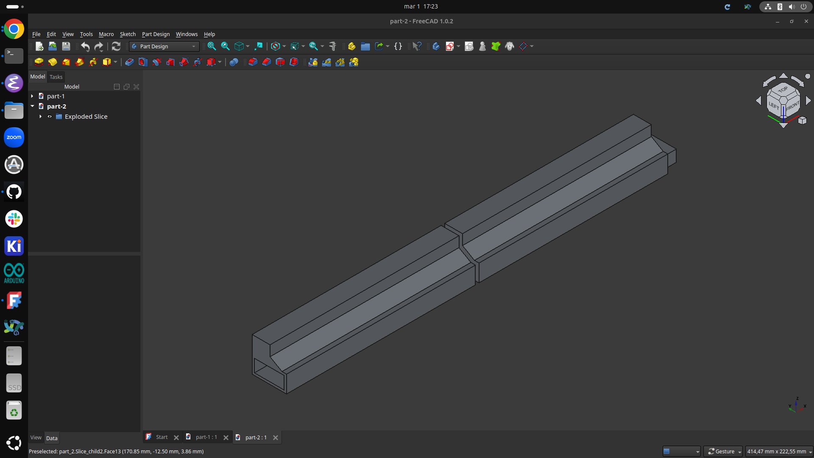
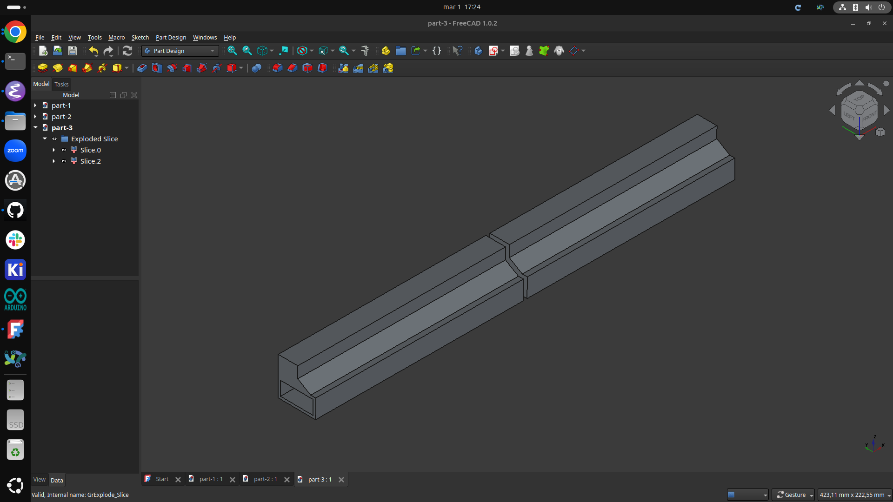
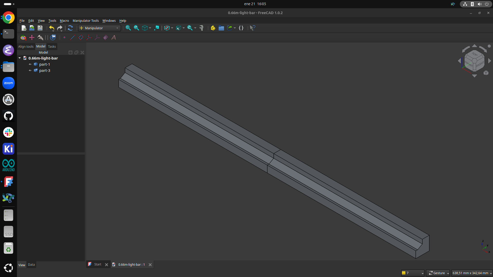
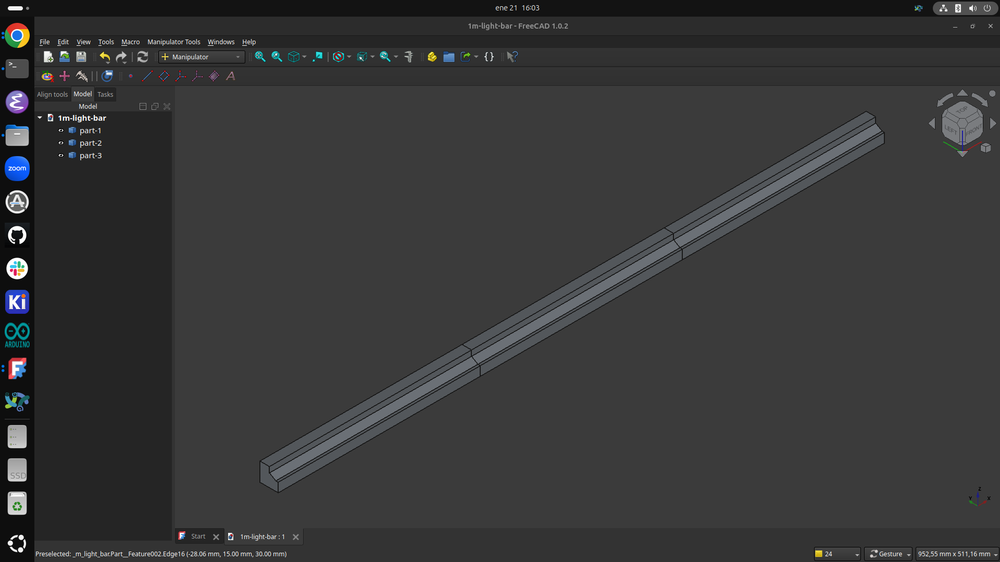
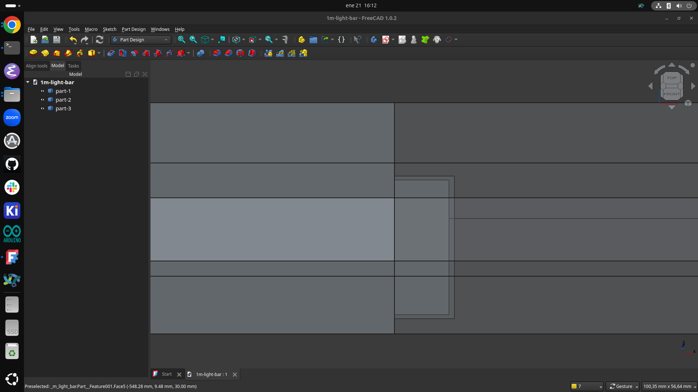
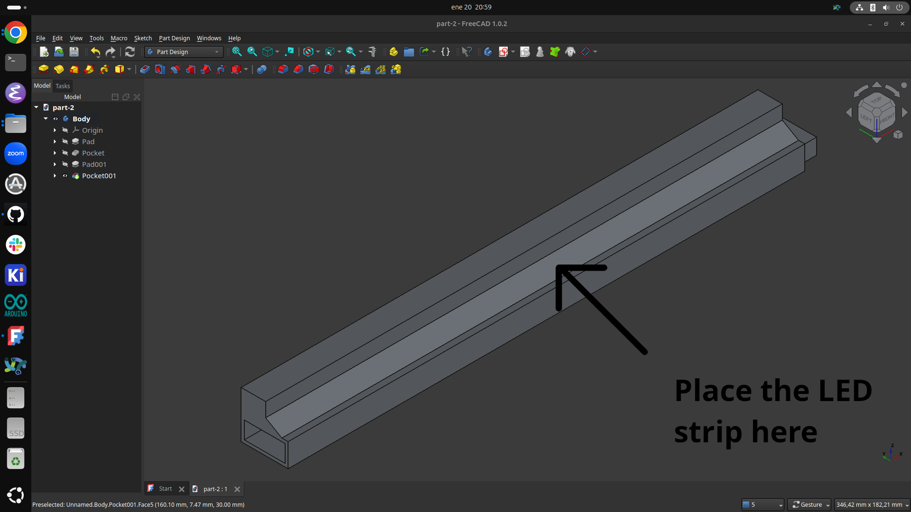
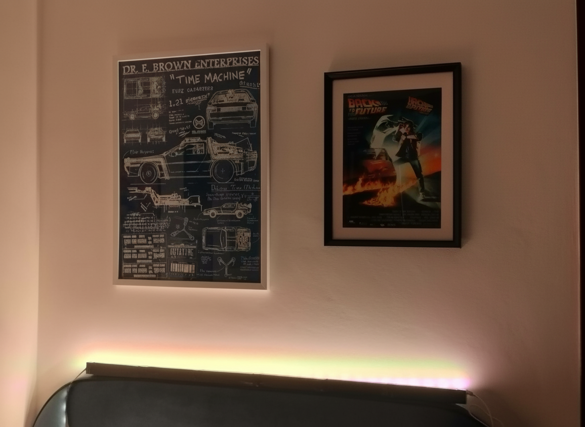
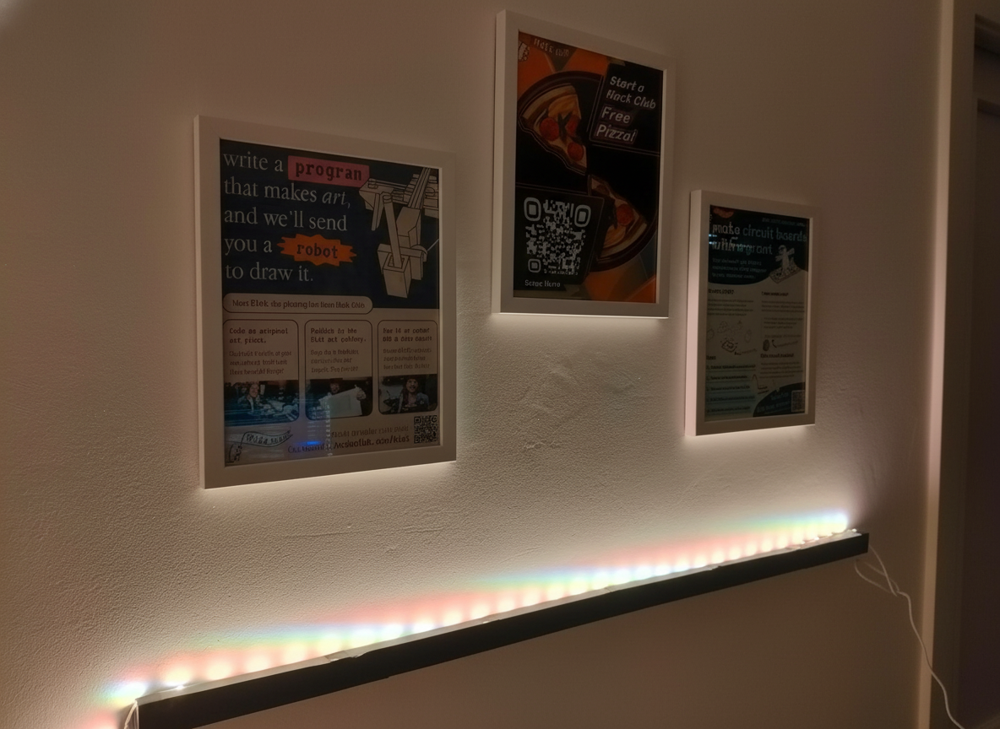

# Posters LED Light Bar

**Full Design Process**: [Blueprint Project](https://blueprint.hackclub.com/projects/10091)

A modular 3D-printed light bar designed to evenly illuminate wall posters using angled LED strips. Features multiple length options (66 cm and 99 cm), a sleek design, and efficient positioning for smooth, balanced light distribution. It’s easy to assemble and enhances your posters with clean, even lighting.
## CAD Screenshots

| Part 1 | Part 2 |
|--------|--------|
|  |  |

| Part 3 | 66 cm Light Bar |
|--------|-----------------|
|  |  |

| 99 cm Light bar | Alignment Slots |
|-----------------|------------------|
|  |  |

## Different Lengths

The design is available in two lengths: 66 cm and 99 cm. The 66 cm version is made up of four 3D-printed pieces, while the 99 cm version uses six pieces. Between every two pieces, there are alignment slots to provide strong connections.

## Usage

Print the required number of sections for your desired length, glue the pieces together using the built-in alignment slots, and attach an LED strip to the surface shown below. Mount the light bar 20–30 cm below your poster and connect the LED strip to a power source to illuminate the poster evenly.

## Why I Built This

I created this project because standard LED strips mounted behind or above posters often produce uneven lighting and don’t look very clean. I wanted a 3D-printed solution that distributes light evenly across the poster while maintaining a simple and clean appearance.

## Light Bar in Action

| View 1 | View 2 |
|--------|--------|
|  |  |

### Light Bar Demo
[Click here to download the light bar demo video (MP4)](https://github.com/adrirubio/posters-led-light-bar/raw/main/demo/led-light-bar-demo.mp4)

### YouTube Demo
[Watch the demo on YouTube](https://youtu.be/ceZwwPQebH8)

## License

MIT License

---

> GitHub [@adrirubio](https://github.com/adrirubio) &nbsp;&middot;&nbsp;
